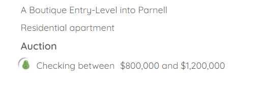
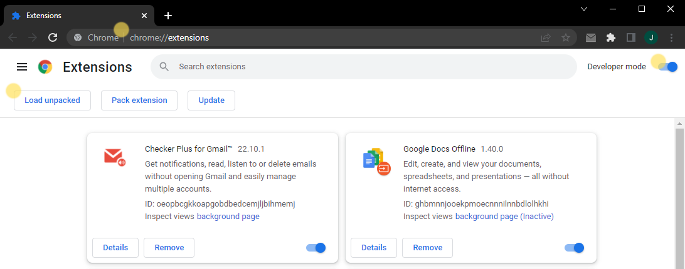
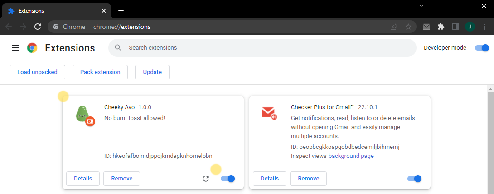
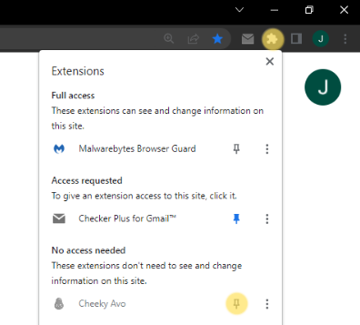
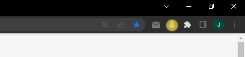

# Search Outage
Currently, TM and RE searches are down or showing wrong results. They have changed their APIs, so I am working on the solution.
 
 
 
# Cheeky Avo 

This custom Chrome / Firefox extension was inspired by Property Price Checker [https://propertyprice.co.nz](https://propertyprice.co.nz)  
It works for 2 of the largest real estate websites in New Zealand: <b>TM</b> and <b>RE</b>. This is an open-source project: feel free to contribute or copy the code as needed. 

 

## Motivation (same as PPC)

 In New Zealand, it is often hard to ascertain the value that a property will sell for, so this additional pricing data point will allow the user to form a more complete picture of the likely sale price with other supplementary information from Homes and One Roof. It will also <b>save you time</b> between narrowing the search parameters on the site to find the listing price range. Instead of having a range of $50K or $100K, this tool <b>gets the exact price that the real estate agent has put as the listing price</b>.
  

<b>Disclaimer</b>: This extension was made for informational and educational purposes only. Derived information should not be taken as financial, investment or legal advice.

<b>Warning</b>: By installing and running this extension you may be in violation of terms of use for TM and RE.

 

## How Does It Work

This extension uses supported sites' normal search functionality to narrow down search results to infer listed price. It is accurate up to $1,000 dollars.

Just navigate normally to listing details and the discovered price will be shown next to listing type (as pictured below):

 

 

 

## Chrome Installation (also works for Edge)
1. Download the zip file from [here](https://downgit.github.io/#/home?url=https://github.com/cheekyavo/cheekyavo/tree/main/extension) and extract the folder to your Desktop.
2. Open Google Chrome and navigate to this url: <b>chrome://extensions/</b> or go to Settings -> Extensions in Chrome's Menu.
3. Turn on Developer Mode and click Load Unpacked in the upper left side:   
   
4. Select the extracted extension folder and click Select Folder in the file prompt.
5. The extension is now loaded in Chrome:  
  
6. Next, click the extensions button in top right and pin Avo to the task bar:  
  
7. Avo will now light up green every time you visit TM or RE, indicating that it's running for those sites:  
  

 

## Firefox Installation
1. Download the zip file from [here](https://downgit.github.io/#/home?url=https://github.com/cheekyavo/cheekyavo/tree/main/extension) and extract the folder to your Desktop.
2. Follow Firefox installation instructions [here](https://extensionworkshop.com/documentation/develop/temporary-installation-in-firefox/).
 <b>Warning</b>: It appears that the extension loading instructions have to be repeated every time you close Firefox (since it's meant for development testing only). I am looking for a way to make the loading permanent. Please stand by.

 

## Troubleshooting
At times, especially on RE site, the Avo price check will fail to start or will display an error message. In that case, just re-load the listing URL in the browser and try again.
