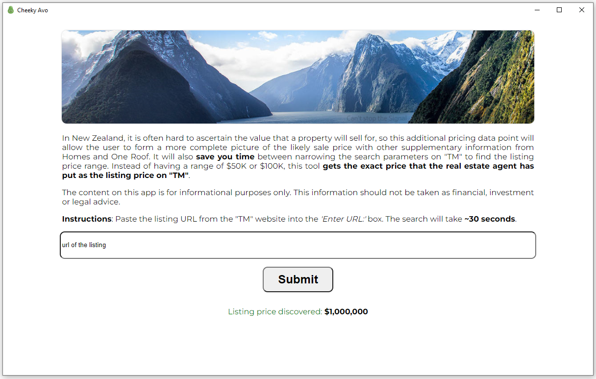

# Cheeky Avo 

This desktop app is an open-source project inspired by Property Price Checker [https://propertyprice.co.nz](https://propertyprice.co.nz)  
The most significant difference from the above project is that this app does not use any of TM's APIs or store any of TM's proprietary data.
## Motivation (same as PPC)

 In New Zealand, it is often hard to ascertain the value that a property will sell for, so this additional pricing data point will allow the user to form a more complete picture of the likely sale price with other supplementary information from Homes and One Roof. It will also <b>save you time</b> between narrowing the search parameters on TM to find the listing price range. Instead of having a range of $50K or $100K, this tool <b>gets the exact price that the real estate agent has put as the listing price on TM</b>. 

The content on this app is for informational purposes only. This information should not be taken as financial, investment or legal advice.

## App Screenshot

## Installation for Non-Techies
1. Download this zip file and extract the folder to your Desktop: 
2. Run CheekyAvo.exe
## Installation for Techies

1. `npm install`
2. `npm start`
